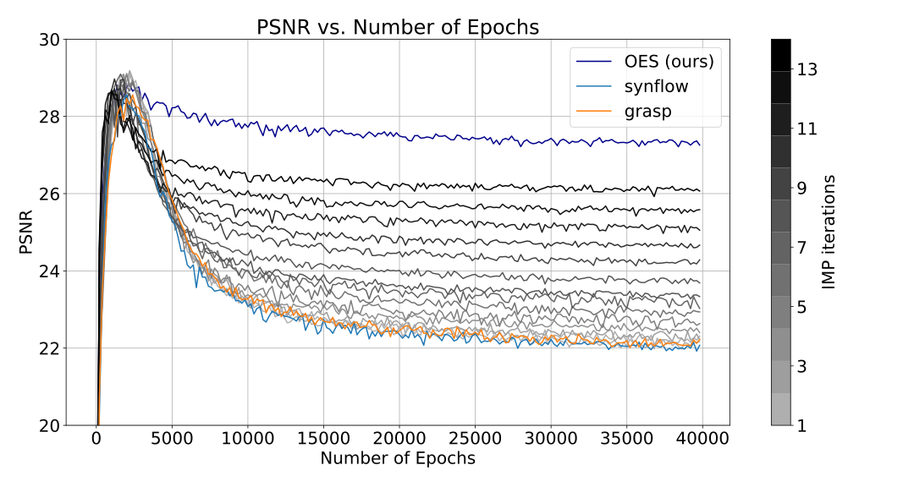

## Optimal Eye Surgeon (ICML-2024)

<div style="display: flex; justify-content: space-around;">
    
    
</div>

This repository contains the source code for pruning image generator networks at initialization to alleviate overfitting.


## Table of Contents
- [Optimal Eye Surgeon (ICML-2024)](#optimal-eye-surgeon-icml-2024)
- [Table of Contents](#table-of-contents)
- [Setup](#setup)
- [Working](#working)
  - [Quick demo:](#quick-demo)
  - [Finding-1: Finding mask at initialization](#finding-1-finding-mask-at-initialization)
  - [Finding-2: Sparse network training](#finding-2-sparse-network-training)
  - [Finding-3: Sparse network transfer](#finding-3-sparse-network-transfer)
    - [Transfer OES masks](#transfer-oes-masks)
  - [Finding-4: Baseline pruning methods](#finding-4-baseline-pruning-methods)
    - [Pruning at initialization Methods](#pruning-at-initialization-methods)
    - [IMP](#imp)


##  Setup
1. Install conda (if not already installed).
2. Create the environment:
```bash
conda create --name oes python==3.7.16
```
3. Activate environment:
Conda:
 ```
 conda activate oes
 ```
4. Install the required packages:
```bash
pip install -r requirements.txt && pip install -e .
```

## Working

### Quick demo:

Please run [OES_demo_comparison.ipynb](OES_demo_comparison.ipynb) to see how OES prevents overfitting in comparison to other methods. (Approximate runtime ~ 10 mins)

Run [impvsoes_comparison.ipynb](impvsoes_comparison.ipynb) to compare OES masks at initialization and IMP masks at convergence. (Approximate runtime ~ 7 mins)

Working with the code to reproduce results for each finding in the paper:

### Finding-1: Finding mask at initialization


The following code implements the above optimization using Gumbel softmax reparameterization trick:

```python
python dip_mask.py --image_name="pepper" --sparsity=0.05
```

to generate supermasks at various sparsity levels as follows


### Finding-2: Sparse network training

After obtaining a mask by the above procedure, run the following to train the sparse network on the image. The sparse network alleviates overfitting:


```python
python train_sparse.py --image_name="pepper"
```

For comparing with baselines, see [Baseline pruning methods](#finding-4-baseline-pruning-methods).

### Finding-3: Sparse network transfer
####  Transfer OES masks

<div style="display: flex; justify-content: space-between;">
  
  
</div>


For OES mask transfer, use the following command:
```python
python transfer.py --trans_type="pai" --transferimage_name="pepper" --image_name="lena"
```

For IMP mask transfer, use the following command:
```python
python transfer.py --trans_type="pat" --transferimage_name="pepper" --image_name="lena"
```

### Finding-4: Baseline pruning methods
#### Pruning at initialization Methods





```python
python baselines/baseline_pai.py --image_name="pepper" --prune_type="grasp_local" --sparse=0.9
```
Chose among the following options for prune_type:

- `rand_global`
- `rand_local`
- `mag_global`
- `snip`
- `snip_local`
- `grasp`
- `grasp_local`
- `synflow`
- `synflow_local`

#### IMP
```python
python baselines/baseline_pat.py --image_name="pepper" --prune_iters=14 --percent=0.2
```
The above line runs IMP for 14 iterations with 20% deletion of weights at each iteration. Resulting in 5% sparsity. (drastic pruning degrades performance)

