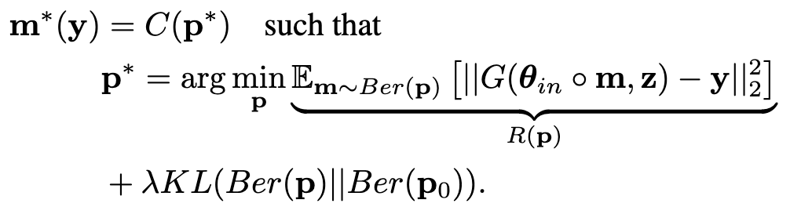
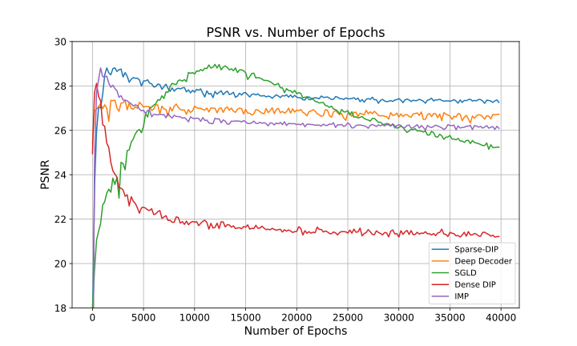
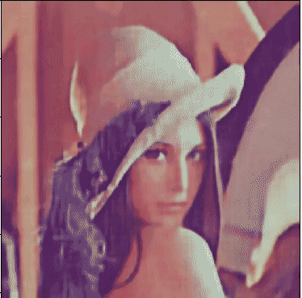
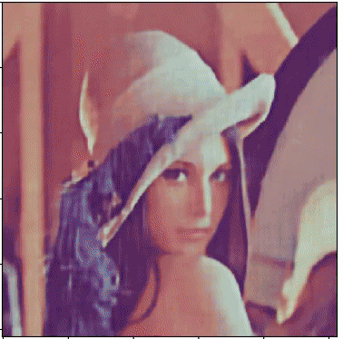

## Optimal Eye Surgeon (ICML-2024)

<div style="display: flex; justify-content: space-around;">
    
    
</div>

This repository contains the source code for pruning image generator networks at initialization to alleviate overfitting.


## Table of Contents
- [One-time Setup](#one-time-setup)
  - [Installation](#installation)
  - [Environment Setup](#environment-setup)
- [Updating](#updating)

- [Working with the Code](#working-with-the-code)
  - [Finding-1: Finding mask at initialization](#finding-1-finding-mask-at-initialization)
  - [Finding-2: Sparse network training](#finding-2-sparse-network-training)
  - [Finding-3: Sparse network transfer](#finding-3-sparse-network-transfer)
    - [Transfer OES masks](#transfer-oes-masks)
    - [Transfer IMP masks](#transfer-imp-masks)
  - [Finding-4: Baseline pruning methods](#finding-4-baseline-pruning-methods)
    - [Pruning at initialization Methods](#pruning-at-initialization-methods)
    - [IMP](#imp)


- [Contributing](#contributing)
- [License](#license)


##  Setup
1. Install conda (if not already installed).
2. Create the environment: 
```bash
conda env create -f environment.yml
```
3. Activate environment:
 ```bash
 conda activate lot
 ```


## Working 

For a quick demo, please run OES_demo_comparison.ipynb to see how OES prevents overfitting in comparison to other methods.

Working with the code to reproduce results for each finding in the paper:

### Finding-1: Finding mask at initialization



The following code implements the above optimization using Gumbel softmax reparameterization trick:

```python
python dip_mask_clean.py --image_name="pepper" --sparsity=0.05
```

to generate supermasks at various sparsity levels as follows


### Finding-2: Sparse network training

Implements sparse network training on the image to alleviate overfitting:




To run sparse network training on the image, use the following command:
```python
python train_sparse_clean.py --image_name="pepper"
```

For comparing with baselines, use the following command:

For running deep decoder:

```python
python vanilla_decoder_clean.py --image_name="pepper"
```

Running vanilla deep image prior:

```python
python vanilla_dip_clean.py --image_name="pepper"
```

Running SGLD:

```python   
python sgld_clean.py --image_name="pepper"
```

### Finding-3: Sparse network transfer
####  Transfer OES masks




```python 
python transfer_clean.py --trans_type="pat" --transferimage_name="lena" --image_name="baboon"
```

### Finding-4: Baseline pruning methods
#### Pruning at initialization Methods

```python
python baseline_pai_clean.py --image_name="pepper"
```

#### IMP
```python
python baseline_pat_clean.py --image_name="pepper"
``